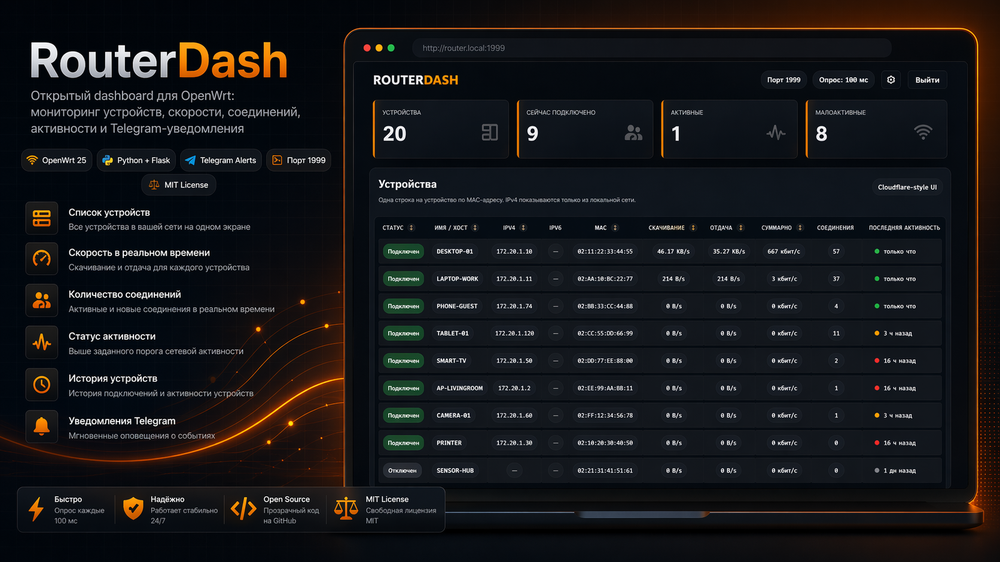

<p align="center">
  
</p>

<p align="center">
  <b>Open-source dashboard for OpenWrt</b><br>
  Мониторинг устройств, скорости, соединений, активности и Telegram-уведомления.
</p>

<p align="center">
  
  
  
  
</p>

## Что это

**RouterDash** — лёгкий веб-интерфейс для OpenWrt, который показывает устройства в сети, текущую скорость, активные соединения, историю присутствия и события для Telegram-уведомлений.

Проект рассчитан на запуск прямо на роутере и использует штатные механизмы OpenWrt: `nlbwmon`, `ubus`, DHCP leases и `ip neigh`.

## Возможности

- список всех обнаруженных устройств по MAC-адресу;
- текущая скорость скачивания и отдачи;
- количество активных соединений;
- статусы устройств: подключен, малоактивен, отключен;
- история событий и панель логов;
- Telegram-уведомления по выбранным устройствам;
- веб-настройка порогов активности, polling interval и учётных данных администратора;
- поддержка IPv6 в интерфейсе.

## Требования

- **OpenWrt 25.12+**
- пакетный менеджер **apk**
- доступ по SSH к роутеру
- файлы проекта в одной папке:
  - `install.sh`
  - `routerdash.py`
  - `routerdash.init`

## Быстрая установка

Установка выполняется **только через `install.sh`**.

### 1. Скопируйте файлы на роутер

Пример:

```sh
scp install.sh routerdash.py routerdash.init root@192.168.1.1:/tmp/routerdash/
```

### 2. Подключитесь по SSH

```sh
ssh root@192.168.1.1
```

### 3. Запустите установщик

```sh
cd /tmp/routerdash
chmod +x install.sh
./install.sh
```

## Что делает install.sh

Скрипт:

- устанавливает пакеты `python3`, `python3-flask`, `ca-bundle`, `nlbwmon`, `iwinfo`;
- копирует приложение в `/opt/routerdash/routerdash.py`;
- ставит init-скрипт в `/etc/init.d/routerdash`;
- включает и перезапускает `nlbwmon`;
- включает и запускает `routerdash`;
- после установки предлагает открыть панель по адресу `http://ROUTER_IP:1999`.

## Первый запуск

После установки откройте в браузере:

```text
http://192.168.1.1:1999
```

При первом входе RouterDash попросит создать логин и пароль администратора.

## Управление сервисом

```sh
/etc/init.d/routerdash status
/etc/init.d/routerdash restart
/etc/init.d/routerdash stop
/etc/init.d/routerdash start
```

Логи:

```sh
logread -e routerdash
```

## Быстрое удаление

Текущий `install.sh` устанавливает проект, но не содержит отдельного режима uninstall.  
Поэтому удаление выполняется вручную следующими командами:

```sh
/etc/init.d/routerdash stop || true
/etc/init.d/routerdash disable || true
rm -f /etc/init.d/routerdash
rm -rf /opt/routerdash
rm -rf /etc/routerdash
```

### Опционально: убрать установленные зависимости

Делайте это только если они не нужны другим сервисам на роутере:

```sh
apk del python3 python3-flask ca-bundle iwinfo nlbwmon
```

> `nlbwmon` может использоваться и другими сценариями, поэтому удаляйте его только если точно уверены.

## Важное замечание по удалению

Во время установки скрипт меняет конфигурацию `nlbwmon` через `uci`.  
Если вы хотите полностью вернуть прежние параметры, проверьте вручную файл конфигурации OpenWrt и сервис `nlbwmon`.

## Если интерфейс не открывается

Проверьте, что сервис запущен:

```sh
ps | grep routerdash
ss -lntp | grep 1999
```

Если доступ к самому роутеру ограничен firewall, разрешите TCP-порт `1999`.

## Структура проекта

```text
.
├── install.sh
├── routerdash.py
└── routerdash.init
```

## Roadmap

- режим uninstall через `install.sh uninstall`;
- экспорт/импорт настроек;
- более гибкие Telegram-правила;
- дополнительные сетевые метрики.

## License

MIT
