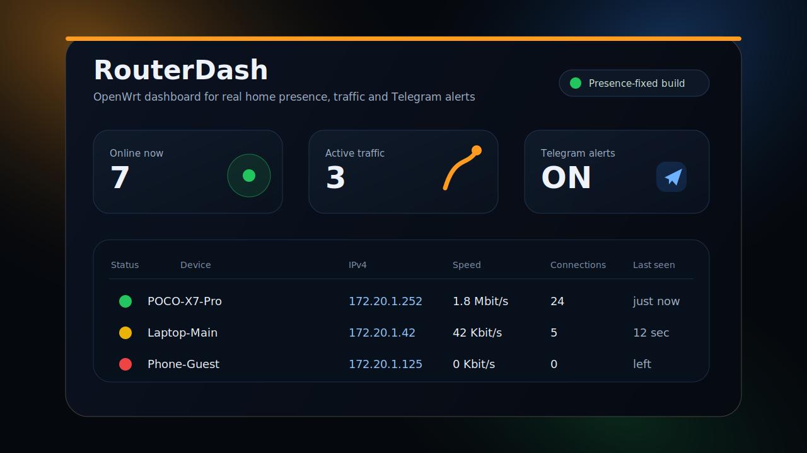

<p align="center">
  
</p>

<h1 align="center">RouterDash для OpenWrt</h1>

<p align="center">
  <b>Веб-панель для контроля домашней сети, реального присутствия устройств, скорости, соединений и Telegram-уведомлений.</b>
</p>

<p align="center">
  
  
  
  
</p>

---

## Что такое RouterDash

**RouterDash** — это лёгкая веб-панель для OpenWrt, которая показывает устройства в локальной сети и помогает понять главное: **кто действительно находится дома, кто только что появился, а кто уже ушёл из зоны сети**.

Проект ориентирован не просто на красивую таблицу DHCP-клиентов, а на практический мониторинг присутствия. Обычные DHCP leases часто обманывают: телефон уже ушёл, но аренда адреса ещё висит; устройство спит, но запись в списке клиентов осталась. RouterDash использует более строгую модель определения: активные соединения, прирост трафика, Wi‑Fi association, ARP/ND-состояния и контрольную проверку `ping`/`ip neigh` перед отправкой уведомления об уходе.

## Возможности

- **Красивая web-панель** на порту `1999` с адаптивным интерфейсом.
- **Статусы устройств:** online, idle, offline.
- **Определение реального присутствия**, а не просто наличие DHCP lease.
- **Telegram-уведомления** о появлении и уходе устройств.
- **Выбор устройств для уведомлений**, чтобы не получать лишний шум.
- **Скорость по устройствам:** download, upload, total.
- **Активные соединения** и направления трафика.
- **История событий** прямо в панели.
- **Русский и английский интерфейс** с выбором языка при установке и в UI.
- **Настройки из панели:** сеть CIDR, пороги активности, Telegram, логин/пароль, порт.
- **Автоустановка из GitHub** одной командой.

## Для чего это нужно

RouterDash закрывает бытовой и админский сценарий: понять, когда человек пришёл домой или покинул дом, без ручной проверки роутера.

Примеры:

- ребёнок пришёл домой — телефон появился в Wi‑Fi/локальной сети;
- сотрудник подключился к локальной сети офиса;
- гость ушёл из зоны Wi‑Fi;
- устройство пропало из сети и не отвечает после контрольной проверки;
- нужно быстро увидеть, какие клиенты прямо сейчас создают трафик.

## Как RouterDash определяет присутствие

RouterDash не доверяет одному источнику данных. Устройство считается присутствующим, если есть один или несколько сильных сигналов:

1. устройство имеет активные записи в `conntrack`;
2. по устройству идёт прирост трафика через `nlbwmon`;
3. Wi‑Fi-клиент подтверждён через `ubus hostapd`;
4. ARP/ND содержит активное состояние `REACHABLE`, `DELAY`, `PROBE` или `PERMANENT`;
5. контрольная проверка `ping`/`ip neigh` подтверждает, что устройство ещё достижимо.

Если активности нет дольше заданного `offline_grace_sec`, RouterDash **не отправляет offline сразу**. Сначала он проверяет последние известные IP-адреса устройства. Только если устройство не подтверждается, оно помечается как покинувшее сеть, и отправляется уведомление.

## Быстрая автоустановка

На OpenWrt выполните одну команду:

```sh
wget -O /tmp/routerdash-installer.sh https://raw.githubusercontent.com/t4kyofc/RouterDASH---OpenWRT/refs/heads/main/install-github-template.sh && sh /tmp/routerdash-installer.sh
```

Альтернативный вариант через `curl`:

```sh
curl -L -o /tmp/routerdash-installer.sh https://raw.githubusercontent.com/t4kyofc/RouterDASH---OpenWRT/refs/heads/main/install-github-template.sh && sh /tmp/routerdash-installer.sh
```

Установщик:

1. предложит выбрать язык установки;
2. скачает основной `install.sh` из репозитория;
3. скачает файлы проекта;
4. установит зависимости;
5. создаст конфигурацию;
6. включит автозапуск;
7. запустит сервис `routerdash`;
8. покажет адрес панели.

После установки откройте:

```text
http://IP_РОУТЕРА:1999
```

Например:

```text
http://192.168.1.1:1999
```

При первом входе RouterDash предложит создать логин и пароль администратора.

## Ручная установка из архива или локальной папки

Скопируйте файлы на роутер:

```sh
scp -r RouterDASH---OpenWRT root@192.168.1.1:/tmp/routerdash
```

Подключитесь к роутеру и запустите установку:

```sh
ssh root@192.168.1.1
cd /tmp/routerdash
sh install.sh
```

## Обновление

Повторно запустите автоустановщик:

```sh
wget -O /tmp/routerdash-installer.sh https://raw.githubusercontent.com/t4kyofc/RouterDASH---OpenWRT/refs/heads/main/install-github-template.sh && sh /tmp/routerdash-installer.sh
```

Если RouterDash уже установлен, меню предложит выполнить установку/обновление или удаление.

## Управление сервисом

```sh
service routerdash start
service routerdash stop
service routerdash restart
service routerdash status
service routerdash enable
service routerdash disable
```

Логи:

```sh
logread -e routerdash
```

## Основные настройки

Настройки доступны через шестерёнку в правой верхней части панели.

| Параметр | Рекомендация | Описание |
|---|---:|---|
| `poll_interval_ms` | `1000–2000` | Частота обновления панели и мониторинга. |
| `offline_grace_sec` | `120–240` | Сколько ждать без активности перед проверкой ухода. |
| `presence_probe_cooldown_sec` | `20–45` | Интервал между контрольными проверками устройства. |
| `activity_total_kbps` | `250` | Порог, выше которого устройство считается активным. |
| `notification_total_kbps` | `500` | Порог для уведомлений об активном использовании. |
| `local_network_cidr` | ваша LAN-сеть | Например `192.168.1.0/24` или `172.20.1.0/24`. |

Для сценария «понять, пришёл человек домой или ушёл» лучше не ставить слишком маленький `offline_grace_sec`. Телефоны часто засыпают, экономят батарею и временно не создают соединений.

## Telegram-уведомления

RouterDash может отправлять уведомления в Telegram:

- устройство появилось в сети;
- устройство подтверждённо покинуло сеть;
- устройство стало активно использовать сеть;
- активность устройства снизилась.

Пример уведомления:

```text
🟢 POCO-X7-Pro появился в сети
IP: 172.20.1.252
MAC: c2:e4:cd:10:8c:50
```

Offline-уведомление отправляется только после проверки, чтобы не было ложных сообщений из-за сна телефона или временного отсутствия активных соединений.

## Зависимости

Установщик ставит необходимые пакеты автоматически, но в целом RouterDash использует:

- `python3`
- `python3-flask`
- `nlbwmon`
- `iwinfo`
- стандартные инструменты OpenWrt: `ip`, `ubus`, `ping`, `conntrack`/`nf_conntrack`

## Структура проекта

```text
RouterDASH---OpenWRT/
├── routerdash.py                  # основной Flask backend + web UI
├── routerdash.init                # init.d service для OpenWrt
├── install.sh                     # локальный установщик
├── install-github-template.sh     # bootstrap-установщик из GitHub
├── blinker.py                     # совместимость Flask-зависимостей
├── docs/
│   └── routerdash-preview.svg     # превью README
└── README.md
```

## Рекомендуемый рабочий сценарий

1. Установить RouterDash одной командой.
2. Открыть web-панель на `http://router-ip:1999`.
3. Создать администратора.
4. Указать правильную локальную сеть в CIDR, например `172.20.1.0/24`.
5. Включить Telegram.
6. Выбрать только важные устройства для уведомлений.
7. Поставить `offline_grace_sec` примерно `180` секунд.
8. Проверить, что уведомления приходят только после реального появления/ухода устройства.

## Безопасность

- Панель защищается логином и паролем.
- Telegram token хранится локально в конфигурации роутера.
- Рекомендуется открывать RouterDash только внутри LAN или через собственный VPN.
- Не публикуйте порт `1999` напрямую в интернет.

## Типичные проблемы

### Устройство быстро появляется и пропадает

Увеличьте:

```text
offline_grace_sec = 180–240
presence_probe_cooldown_sec = 30–45
```

### IP отображается неправильно или не отображается

Проверьте `local_network_cidr`. Для сети `172.20.1.0/24` значение должно быть:

```text
172.20.1.0/24
```

После изменения сети лучше перезапустить сервис:

```sh
service routerdash restart
```

### Нет данных по скорости

Проверьте `nlbwmon`:

```sh
service nlbwmon status
service nlbwmon restart
```

### Не приходят Telegram-уведомления

Проверьте:

- включён ли Telegram в настройках;
- заполнены ли bot token и chat_id;
- выбран ли нужный MAC, если включён режим «только выбранные устройства»;
- есть ли доступ роутера к `api.telegram.org`.

## Статус проекта

RouterDash развивается как практичная панель мониторинга OpenWrt для домашней и небольшой офисной сети. Главный фокус — понятная визуализация, точное определение присутствия устройств и полезные уведомления без лишнего шума.

---

<p align="center">
  <b>RouterDash</b> — когда важно видеть не просто список клиентов, а реальную картину домашней сети.
</p>
